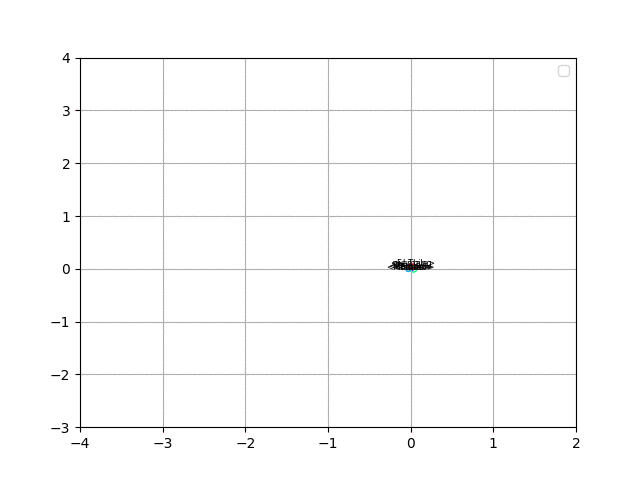

# EL Embeddings

Here you can find the code to generate spherical embeddings for the
description logic EL++ (the logic used in OWL 2 EL).



## How to run

There are two parts that need to be executed sequentially. The first part converts an ontology in OWL 2 EL into a set of one of four normal forms.
The second part of the method generates the embeddings for classes, relations, and individuals.

To build: To generate the normal forms, you need a modified version of the `jcel` reasoner which you find in a submodule here (if you have not cloned this repository with submodules, try
to do `git clone --recurse-submodules https://github.com/leechuck/el-embeddings`.
Next, `cd jcel` and `mvn install` to build the jcel jar files.

For convenience, we include the jar file in the `jar/` subdirectory, so you may simply want to add `jcel.jar` to your CLASSPATH.
Then run `groovy Normalizer.groovy` and follow the instructions (i.e., command line options are in input OWL file and and output file containing the normal forms in OWL functional syntax).

```
usage: groovy Normalizer.groovy -i INPUT -o OUTPUT [-h]
 -h,--help           this information
 -i,--input <arg>    input OWL file
 -o,--output <arg>   output file containing normalized axioms
```

To generate the embeddings, run `python elembedding.py --help` and
follow instructions. You need CUDA installed to use a GPU, and need to
install python libraries with:
```
pip install -r requirements.txt
```

```
Usage: python elembedding.py [OPTIONS]

Options:
  -df, --data-file TEXT           Normalized ontology file (Normalizer.groovy)
  -vdf, --valid-data-file TEXT    Validation data set
  -ocf, --out-classes-file TEXT   Pandas pkl file with class embeddings
  -orf, --out-relations-file TEXT
                                  Pandas pkl file with relation embeddings
  -bs, --batch-size INTEGER       Batch size
  -e, --epochs INTEGER            Training epochs
  -d, --device TEXT               GPU Device ID
  -es, --embedding-size INTEGER   Embeddings size
  -rn, --reg-norm INTEGER         Regularization norm
  -m, --margin FLOAT              Loss margin
  -lr, --learning-rate FLOAT      Learning rate
  -lhf, --loss-history-file TEXT  Pandas pkl file with loss history
  --help
```

## Data

Data is available here http://bio2vec.net/data/elembeddings/el-embeddings-data.zip

Embeddings for yeast and human
http://bio2vec.net/data/elembeddings/embeddings.tar.gz

## How to cite

If you use El-Embeddings for your research, or incorporate our
learning algorithms in your work, please cite:

Maxat Kulmanov, Wang Liu-Wei, Yuan Yan and Robert Hoehndorf;
EL Embeddings: Geometric construction of models for the Description
Logic EL++, [arXiv:1902.10499](https://arxiv.org/abs/1902.10499)
